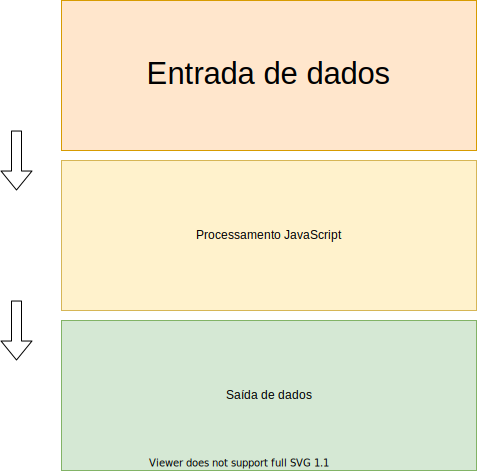

# Coleções, estado e renderização

Existem alguns tipos no JavaScript que servem para armazenar informações para que possamos trabalhar com elas.

Algumas são tipos primários, como: number, string e boolean. Mas os mais interessantes, que vão possibilitar criarmos aplicações realmente avançadas, são: Array e objetos.

## Array e Objetos
Precisamos saber explorar ao máximo esses tipos para obtermos resultados de forma simples e com qualidade.

### Array
O tipo Array é basicamente uma lista que permite armazenar outros tipos.

Exemplos:
```js
const filmeNotas = [4, 3, 4.5, 2, 5, 4.5, 2];

const tags = ['JavaScript', 'JS', 'Programador a Bordo', 'Array', 'Objetos', 'Curso JavaScript'];

const imagens = ['ayrton-profile.png', 'programador-a-bordo.png', 'javascript-raiz.png'];
```

**Array de array (Matriz)**

Quando você tem um array onde seus elementos são outros array's, você tem uma matriz:

```js
const matriz = [ [0, 3, 10], [10, 5, 38], [9, 5, 12] ];
```

Acredito que fique visualmente melhor se quebrarmos linha:

```js
const matriz = [
  [0, 3, 10],
  [10, 5, 38],
  [9, 5, 12]
];
```

Oras... Onde vamos utilizar matriz?

**Jogo da velha (Tic Tac Toe)**


De uma forma simples, a estrutura seria semelhante a essa:

```js
const tictactoe = [
  ['O', 'X', 'O'],
  ['X', 'X', 'O'],
  ['X', 'O', 'X'],
]
```

Isso lembra ou não uma matriz?

**Sudoku**


Pra quem conhece as regras, sabe que a estrutura de arrays do jogo Sudoku é ainda mais complexa

Algo assim (exemplificando a imagem acima):

```js
const sudoku = [
  [
    [5, 3, null],
    [6, null, null],
    [null, 9, 8]
  ],
  [
    [null, 7, null],
    [1, 9, 5],
    [null, null, null]
  ],
  [
    [null, null, null],
    [null, null, null],
    [null, 6, null]
  ],
  [
    [8, null, null],
    [4, null, null],
    [7, null, null]
  ],
  [
    [null, 6, null],
    [8, null, 3],
    [null, 2, null]
  ],
  // ... mais 4 array aqui
];
```

### Objeto
Objeto permite armazenar informações em uma estrutura mais elaborada.

Para definir um objeto da forma literal, basta utilizar chaves `{}`, entre as chaves podemos adicionar pares de chave/valor.

```js
// Criando um objeto vazio
const meuObj = {};
```

Com ele, podemos agrupar dados que formam uma entidade em um único lugar. Semelhante aos objetos depois de instanciar uma classe (Usuário, Carro, Produto, etc.)

Então podemos entender objeto como uma entidade:

```js
const usuario = {
  nome: 'Ayrton',
  sexo: 'M',
  cpf: '00000000000',
  pais: 'Brasil',
}
```

Vamos a um exemplo mais real que podemos usar:


As informações que vão preencher essa área, que é uma página de vídeo do YouTube pode ser facilmente um objeto contendo todas essas informações
```js
const video = {
  id: 'xpto1',
  video: 'link-do-video.mp4',
  titulo: 'React JS - MELHOR GUIA para Iniciantes! (2020)',
  data: '2020-4-30',
  visualizacoes: '22621',
  canal: {
    id: 'canal-id-1',
    nome: 'Programador a Bordo',
    link: 'https://youtube.com/Programador A Bordo'
  },
  likes: 1700,
  dislikes: 18,
  descricao: 'React JS é uma biblioteca...'
};
```

Para saber mais afundo sobre objetos, convido a assistir minha aula sobre, [clicando aqui](https://youtu.be/vB-aPrlSEXs).

Existem novos tipos no JavaScript que permitem mais funcionalidades/recursos com objetos, que são:
- [Map](https://developer.mozilla.org/pt-BR/docs/Web/JavaScript/Reference/Global_Objects/Map)
- [WeakMap](https://developer.mozilla.org/pt-BR/docs/Web/JavaScript/Reference/Global_Objects/WeakMap)
- [Set](https://developer.mozilla.org/pt-BR/docs/Web/JavaScript/Reference/Global_Objects/Set)
- [WeakSet](https://developer.mozilla.org/pt-BR/docs/Web/JavaScript/Reference/Global_Objects/WeakSet)

### Array VS Objetos

**Array**

PRINCIPAIS VANTAGENS

- Consegue garantir ordem dos elementos
- Diversos métodos para realizar as mais diversas operações:
  - Filtrar
  - Buscar
  - Ordenar
  - Transformar

PRINCIPAIS DESVANTAGENS
- Se quiser buscar um valor, precisa percorrer cada elemento do array até ele ser encontrado (imagina uma lista com milhares)

**Objeto** 

PRINCIPAIS VANTAGENS
- Acesso rápido (como um índice) ao valor, ex: `meuObjeto['propriedade']`
- Estrutura melhor definida para armazenas informações (nome de propriedades)

PRINCIPAIS DESVANTAGENS
- Não existem ordenação em objetos. Não garante a ordem.
- Poucos métodos para trabalhar com objetos

### Array + Objetos = Coleção <3
Essa combinação é mais poderosa que queijo com goiabada, café com leite e arroz com feijão!

Brincadeiras a parte.. Saber trabalhar com coleções vai saltar o nível das suas apps! Afinal, quase tudo são coleções nas web apps atuais.

Afinal, o que são coleções? É uma lista de entidades, basicamente.

Imagine a entidade `Usuário`, agora imagina uma lista de usuários!

Exemplo:

```js
const usuarios = [
  {
    nome: 'Ayrton',
    sexo: 'M',
    cpf: '00000000000',
    pais: 'Brasil',
  },
  {
    nome: 'Maria',
    sexo: 'F',
    cpf: '00000000002',
    pais: 'Brasil',
  },
  {
    nome: 'Joaquim',
    sexo: 'M',
    cpf: '00000000003',
    pais: 'Brasil',
  }
];
```
Essa é a coleção usuários.

Agora que você já sabe o que é uma coleção, deixa eu te mostrar elas nas mais diversas aplicações web que vemos por aí:


Na coluna direita temos uma coleção de vídeos recomendados!

Poderia ser algo semelhante a isso:

```js
const videosRecomendados = [
  {
    id: 'xpto1',
    titulo: 'React JS Curso Rápido: Masterclass #1 2020 - 100% prático',
    canal: 'Cod3r Cursos',
    visualizacoes: '47k',
    data: '6 months'
  },
  {
    id: 'xpto2',
    titulo: 'Antes de Desistir da Programação, Veja Esse Vídeo',
    canal: 'Filipe Deschamps',
    visualizacoes: '63k',
    data: '1 month',
    image: 'https://youtube.com/thumbnail02.png'
  },
  {
    id: 'xpto3',
    titulo: 'Estudo JavaScript mas NUNCA Aprendo! (3 dicas INFALÍVEIS',
    canal: 'Programador a Bordo',
    visualizacoes: '7.3k',
    data: '6 months',
    image: 'https://youtube.com/thumbnail03.png'
  },
  // etc.
];
```

O mesmo com os comentários (Coleção de comentários)


```js
const videoComentarios = [
 {
   id: 'cxpto1',
   usuario: {
     id: 'user-id-1',
     nome: 'Programador a Bordo',
     imagem: 'https://youtube.com/pab.pnb'
   },
   texto: 'LIVE sobre JavaScript toda terça...',
   likes: 0,
   dislikes: 0
 },
 {
   id: 'cxpto2',
   usuario: {
     id: 'user-id-1',
     nome: 'Programador a Bordo',
     imagem: 'https://youtube.com/pab.pnb'
   },
   texto: 'Galera! TRÊS recados para vocês:',
   likes: 27,
   dislikes: 0
 },
 {
   id: 'cxpto3',
   usuario: {
     id: 'user-id-2',
     nome: 'Fred Oliveira',
     imagem: 'https://youtube.com/fred.pnb'
   },
   texto: '"Automagicamente" não me sinto mais neandertal na frente do ReactJS. Obrigado, bro.',
   likes: 15,
   dislikes: 0
 },
]
```

Observe que um comentário, pode ter respostas. Ou seja, uma coleção de respostas (voltamos ao exemplo acima):

```js
const videoComentarios = [
 // ...
 {
   id: 'cxpto2',
   usuario: {
     id: 'user-id-1',
     nome: 'Programador a Bordo',
     imagem: 'https://youtube.com/pab.pnb'
   },
   texto: 'Galera! TRÊS recados para vocês:',
   likes: 27,
   dislikes: 0,
   respostas: [
     {
      id: 'cxpto12',
      usuario: {
        id: 'user-id-12',
        nome: 'Joana',
        imagem: 'https://youtube.com/joana.pnb'
      },
      texto: 'Opa, pode deixar!!',
      likes: 1,
      dislikes: 0,
     },
     {
      id: 'cxpto23',
      usuario: {
        id: 'user-id-3',
        nome: 'José Silva',
        imagem: 'https://youtube.com/jose.pnb'
      },
      texto: 'Boooora!',
      likes: 3,
      dislikes: 0,
     }
   ]
 },
 // ...
]
```

Vamos só ver mais umas imagens de coleções (collections everywhere)


Coleção de vídeos (como playlists) no Prime Vídeos


Lista de viagens disponíveis do ônibus no trecho Rio x SP


Uma enquete, coleção de opções, exemplo do Google Forms


## Trabalhando em coleções

Agora que entendemos a importância de coleções junto com seus usos, precisamos ficar mestre em trabalhar com elas.

Em coleções fazemos constantemente operações como:
- Buscas
- Atualizações
- Transformações
- Deleções
- Combinações (merge)
- Filtros
- Ordenações

Os principais métodos de array para você fazer a maioria dessas operações, são: 
- [find](https://developer.mozilla.org/pt-BR/docs/Web/JavaScript/Reference/Global_Objects/Array/find)
- [includes](https://developer.mozilla.org/pt-BR/docs/Web/JavaScript/Reference/Global_Objects/Array/contains)
- [sort](https://developer.mozilla.org/pt-BR/docs/Web/JavaScript/Reference/Global_Objects/Array/sort)
- [map](https://developer.mozilla.org/pt-BR/docs/Web/JavaScript/Reference/Global_Objects/Array/map)
- [filter](https://developer.mozilla.org/pt-BR/docs/Web/JavaScript/Reference/Global_Objects/Array/filtro)
- [reduce](https://developer.mozilla.org/pt-BR/docs/Web/JavaScript/Reference/Global_Objects/Array/reduce)
- [flat](https://developer.mozilla.org/pt-BR/docs/Web/JavaScript/Reference/Global_Objects/Array/flat)
- [flatMap](https://developer.mozilla.org/pt-BR/docs/Web/JavaScript/Reference/Global_Objects/Array/flatMap)

As vezes temos um objeto que precisamos converter em array e vice-versa:

- [Object.entries](https://developer.mozilla.org/pt-BR/docs/Web/JavaScript/Reference/Global_Objects/Object/entries)
- [Object.fromEntries](https://developer.mozilla.org/pt-BR/docs/Web/JavaScript/Reference/Global_Objects/Object/fromEntries)
- [Object.keys](https://developer.mozilla.org/pt-BR/docs/Web/JavaScript/Reference/Global_Objects/Object/keys)
- [Object.values](https://developer.mozilla.org/pt-BR/docs/Web/JavaScript/Reference/Global_Objects/Object/values)

**Eu mostro muito o uso de alguns desses métodos em uma aula minha, [clique aqui para acessar](https://youtu.be/a6TEbMTz5no)!**

Os métodos `Object.entries` e `Object.fromEntries` são realmente interessantes e poderosos..

Muita das vezes você vai se pegar fazendo operações com `reduce` sendo que seria muito mais simples com eles!

A possibilidade de transformar facilmente um objeto em array, para assim se bebeficiar de métodos como map, filter, etc. e depois transformar em objeto novamente, vai te ajudar muito como desenvolvedor.

### Normalização de dados
Normalizar dados significa deixar ele em um formato que seja mais fácil, para nós devs, utilizar.

Muita das vezes, buscamos vários dados em vários lugares diferentes e eles estão em um formato ruim de trabalhar no nosso código. Para isso, precisamos normalizar e assim conseguir utilizar da melhor maneira.

Normalizar envolve (explico cada tópico mais a frente):
- Resolver muitos níveis em um mesmo objeto/array
- Permitir acesso rápido/ágil a informação

> Tecnologias como GraphQL resolvem muito essa etapa

**Resolver muitos níveis em um mesmo objeto/array**

Vamos imaginar um cenário que estamos montando a página de um curso para listar os módulos e aulas disponíveis para o aluno assistir.

Assim, temos o seguinte objeto:

```js
const curso = {
  id: 'xpto1',
  titulo: 'JS Raiz',
  modulos: [
    {
      id: 'mod1',
      nome: 'Fundamentos',
      aulas: [
        {
          id: 'aul1',
          nome: 'Introdução',
          materiais: [
            {
              id: 'mat1',
              arquivo: 'requisitos.pdf'
            },
            {
              id: 'mat2',
              arquivo: 'sintaxe.pdf'
            }
          ]
        },
        {
          id: 'aul2',
          nome: 'Tipos Primitivos',
          materiais: [
            {
              id: 'mat3',
              arquivo: 'tipos.pdf'
            }
          ]
        }
      ]
    },
    {
      id: 'mod2',
      titulo: 'Paradigma Funcional',
      aulas: [
        {
          id: 'aul3',
          nome: 'Vantagens1',
          materiais: [
            {
              id: 'mat4',
              arquivo: 'paradigma-funcional.pdf'
            }
          ]
        }
      ]
    }
  ]
};
```

Observe que todas as informações estão dentro desse objeto. É um objeto aninhado!

O que quero dizer com aninhado?

Significa que algumas informações, caso eu queira acessar, estão em um nível muito profundo.

Vamos dizer que eu queria pegar o material da aula 2 do módulo de fundamentos, eu precisaria fazer o seguinte:

```js
console.log(curso.modulos[0].aulas[1].materiais[0].arquivo)
```

Veja o nível de profundidade que precisamos chegar para conseguir a informação
```
curso >> modulos >> aulas >> materiais
```

Agora vem a questão: E se quisermos fazer uma lista com todos os materiais de todas as aulas para por em uma parte da página do aluno, para que ele consiga acessar com facilidade qualquer material sem precisar ir na página da aula para pegar?

Para isso, precisamos normalizar da melhor forma que possamos acessar depois.


**Permitir acesso rápido/ágil a informação**

Imagina uma coleção com centenas de usuário onde queremos listar em nossa página, ficaria semelhante a isso:

| Nome | - |
| --- | --- |
| Ayrton Senna | Editar |
| Michael Jordan | Editar |
| Madona | Editar |
| Pelé | Editar |
| Buda | Editar |
| Steve Jobs | Editar |
| Barack Obama | Editar |

Vamos parar por aí mas imagine que tenha milhares de usuários..

Ao clicar em Editar, capturamos o ID do usuário e precisamos buscar na coleção!

Só que se essa coleção tiver centenas (ou milhares) de usuários, significa que a cada clique em editar, precisamos buscar nessa lista gigantesca, um a um até encontrar.

A melhor forma de resolver isso também é normalizando os dados. O processo de normalizar nesse caso, vai ser transformar uma coleção em um objeto!

Onde cada chave vai ser o ID do usuário e seu valor vai ser o usuário em si.

O resultado final desse objeto seria assim:

```js 
const usuarios = {
  'id-xpto1': {
    id: 'id-xpto1',
    nome: 'Ayrton Senna'
  },
  'id-xpto2': {
    id: 'id-xpto1',
    nome: 'Michael Jordan'
  },
  'id-xpto3': {
    id: 'id-xpto3',
    nome: 'Madona'
  },
  'id-xpto4': {
    id: 'id-xpto4',
    nome: 'Pelé'
  },
  'id-xpto5': {
    id: 'id-xpto5',
    nome: 'Buda'
  },
  'id-xpto6': {
    id: 'id-xpto6',
    nome: 'Steve Jobs'
  },
  'id-xpto7': {
    id: 'id-xpto7',
    nome: 'Barack Obama'
  },
  // ... Outras dezenas aqui
};
```

Agora fica fácil acessar qualquer usuário, basta ter o ID em mãos:

```js
const usuarioID = 'id-xpto6';
console.log(usuarios[usuarioID]);
```

## Estado

Dando uma pincelada em algo crucial em desenvolvimento de web apps.

Gerenciamento de estado é uma das camadas para desenvolver aplicações web, porém, a única informação aqui é que um estado basicamente é uma composição de objetos, array e outros tipos no JavaScript.

Você mantém toda a estrutura da informação que precisa armazenado nesses tipos, por isso é muito importante saber trabalhar com eles, saber utilizar as funções mencionadas acima e também sobre normalização de dados.

Aqui é só mais um ponto de atenção para reforçar a importância desse tópico.

## Renderização
Retornemos as camadas inicias de desenvolvimento front-end



Tudo que vimos em 'Trabalhando com coleções' está na etapa **Processamento JavaScript**. 

Uma vez que realizamos todas as operações em nossas coleções, falta agora refletir essas informações na tela visualmente. Ou seja, camada **Saída de dados**.

Se estivermos desenvolvendo com JavaScript puro, sem nenhuma lib que atualize a interface para gente, então vamos ter que atualizar manualmente com as novas informações.

> A parte mais interessante em bibliotecas como `React`, é que basta atualizar nossas entidades, listas e coleções que automaticamente ele reflete essa mudança na tela