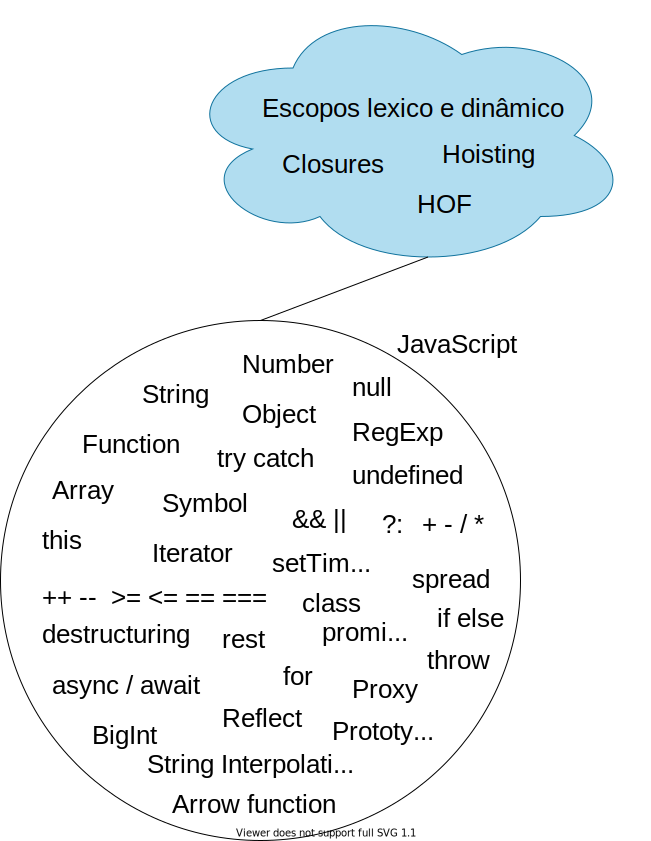

# Imersão Fundamentos
Para entendermos JavaScript e não ficarmos perdido com tudo o que envolve a linguagem, precisamos clarear alguns conceitos para seguirmos em frente com tranquilidade. 

## Continente JavaScript
Imagine o seguinte círculo como se fosse um continente, o continente JavaScript.

> Vou usar o termo continente para facilitar algumas explicações

> Cada continente tem seus países


Essas são funcionalidades/recursos nativas do JavaScript, aquelas que vem na [especificação da linguagem](https://www.ecma-international.org/ecma-262/11.0/index.html).

Está tudo aí, disponibilizado para você utilizar e começar a escrever seus programas.

Elas são como teclas de um piano, não bastam estar lá, precisa saber tocar!

A forma como você vai conduzir essa música, o seu programa, e utilizar todas as funcionalidades disponíveis, dependem do paradigma aplicado!

## Paradigma
O paradigma dita o ritmo, a melodia. A forma como você orquestra tudo que está disponível para você.

O JavaScript é uma linguagem multiparadigma, ou seja, ela permite que você aplique um ou vários no decorrer do seu programa.

São eles:
- Imperativo/procedural
- Orientação a objetos
- Funcional

Ilustrando rapidamente, em código, a representação da mesma funcionalidade em 3 paradigmas diferentes, utilizando JavaScript.

A ideia é simples, a partir de carrinho de produtos, fazer a soma de todos os preços e entregar o valor total:

> Se você é iniciante, não se assuste com os códigos a seguir, é só para ilustrar.

### Imperativo/procedural

```js
let cartItems = [
  { nome: 'Macbook', preco: 15000 },
  { nome: 'Livro clean code', preco: 80.50 },
  { nome: 'Drone XXP', preco: 10350.99 },
];

let total = 0;

function sumTotal() {
  for (let i = 0; i < cartItems.length; i++) {
    total += cartItems[i].preco;
  }
}

sumTotal();

console.log(`Total das compras: ${total}`);
```

No exemplo acima fazemos mudanças direto no estado global da aplicação e sempre criamos instruções passo a passo (em sequência) de como deve ser executado o programa.

### OOP
```js
class Cart {
  constructor(items) {
    this.items = items;
    this.total = 0;
  }
  _sumTotal() {
    for (let i = 0; i < this.items.length; i++) {
      this.total += this.items[i].preco;
    }
  }
  getTotal() {
    this._sumTotal();
    return this.total;
  }
}

const cartItems = [
  { nome: 'Macbook', preco: 15000 },
  { nome: 'Livro clean code', preco: 80.50 },
  { nome: 'Drone XXP', preco: 10350.99 },
];

const cart = new Cart(cartItems);
console.log(`Total das compras: ${cart.getTotal()}`);
```

Em OOP encapsulamos o programa em partes, com isso não fazemos mudanças direto no estado global. Aqui temos a classe `Cart` que por si só não faz nada, até que alguém a utilize.

Com isso essa classe se torna reutilizável e customizável.

### Funcional
```js
const compose = (...fns) => x =>  fns.reduceRight((y, f) => f(y), x);
const sum = itens => itens.reduce(((acc, curr) => acc + curr), 0);
const prop = prop => data => data[prop];
const map = fn => arr => arr.map(fn);

const extractPrice = map(prop('preco'));

const cartItems = [
  { nome: 'Macbook', preco: 15000 },
  { nome: 'Livro clean code', preco: 80.50 },
  { nome: 'Drone XXP', preco: 10350.99 }
];

const sumTotal = compose(sum, extractPrice);
console.log(`Total das compras: ${sumTotal(cartItems)}`);

```

No paradigma funcional construímos nosso programa através da composição de funções. Alguns conceitos moldam o paradigma, como a imutabilidade e funções pura. Além disso, cada função deve ter uma única responsabilidade e são focadas no resultado e não no passo a passo da execução.

---

A forma como você pensa programação e escreve seus códigos, varia de acordo com o paradigma que conhece e utiliza.

Eles tem conceitos diferentes e alguns são melhores para uns cenários e outros melhores para outros.


## Influenciadores
Além das funcionalidades e paradigmas, tem mais um ingrediente que molda o seu desenvolvimento e a forma como você utiliza seus recursos.

Alguns deles são: escopos, hoisting, closures e high order functions.



## Ambiente
Outro fator determinando e que muitas vezes se confundem, principalmente nos iniciantes, é onde o JavaScript está inserido.

Não se engane, a linguagem JavaScript é isso relatado acima. Porém, o seu uso muda muito com o ambiente que ele está inserido. São eles os principais: Navegador, servidor (Node/Deno), desktop (ex: Electron) e mobile.

Cada ambiente desse tem seu próprio continente, como vou estar destacando mais o front-end, dê uma olhada rapidamente no continente navegador:


O navegador evoluiu muito e permite uma experiência rica para o desenvolvedor fornecer aos usuários do site/app.

Algumas das coisas interessantes que é possível fazer dentro do navegador utilizando JavaScript:

- Salvar dados local no navegador do usuário
- Manipular elementos da página
- Arrastar e soltar elementos
- Salvar dados offline para usuário visualizar sem internet
- Fazer requisições para serviços  
- Receber respostas de serviços externos (texto, imagem, arquivos..)
- Manipular audio e vídeo
- Renderizar conteúdo dinamicamente
- Criar animações avançadas

## Continente Front-end

Agora o último continente que vou representar aqui, é o do ecossistema front-end como um todo.

Ele confunde muito hoje em dia quem entra no desenvolvimento web, pois são muitas opções.


Nele temos muita coisa que ajuda o desenvolvedor.

Compilers, template engine, module bundler, package managers, arquiteturas, linguagens, protocolos e muito mais! 

O navegador e dispositivos móveis evoluíram demais, de antes apenas sites estáticos, agora permitindo que rode uma aplicação inteira dentro dele.

O front-end se transformou nos últimos anos e empoderou os devs.

Se antes bastássemos criar um arquivo html, outro css e por fim, um JavaScript. Hoje não, hoje temos ferramentas e recursos como: 
- Checar erros em tempo de desenvolvimento
- Checar padronização em tempo de desenvolvimento
- Gerenciar dependências do projeto
- Utilizar CSS como se fosse uma linguagem de programação
- Escrever HTML 'dentro do JS' com facilidade
- Compiladores
- Tecnologia para que nosso site se comporte como um app nativo

## Continente CSS

O continente CSS tem se tornado cada vez mais importante no desenvolvimento JavaScript!


Hoje em dia, o CSS divide muita responsabilidade com o JavaScript. Por isso é muito importante saber bem CSS para não ter um desenvolvimento complexo no JavaScript de forma desnecessária.

## Mundo JavaScript front-end


## JavaScript
Vamos focar no JavaScript em si. Voltando ao seu continente, podemos dividir o JavaScript, inicialmente, em três macro áreas:


### Sintaxe básica
Aqui envolve praticamente tudo que você precisa aprender para criar seus primeiros programas e desenvolver a lógica.

São coisas como: tipos primitivos (number, string, undefined, boolean, null e Symbol), condicionals, array, objects, loops, functions, operadores aritméticos, operadores lógicos, etc.

Também incluo os influenciadores de comportamentos: closures, escopos, hoisting e high order functions.

### Meta programação
Inserido oficialmente na linguagem a partir do ES6. Meta programação é você conseguir mudar o comportamento nativo de algumas partes da linguagem através do próprio JavaScript.

Principais recursos: Proxy, Reflect e protocolo de iteração (Simbol.Iterator).

### Assíncrono
Muitas das vezes você vai precisar realizar alguma operação assíncrona, como consultar uma API externa, um banco de dados, um serviço qualquer e não quer que sua aplicação fique travada até ter a resposta dessa operação.

Para orquestrar essa parte assíncrona, o JavaScript disponibiliza algumas funcionalidades como: Promise, Async/Await e callbacks.


## Organizando para focar
Afinal, o que aprender primeiro? Vamos lá..

Eu quebrei em 4 categorias, são elas: 
- Fundamental
- Facilitador
- Um passo a frente
- Bastidores.

Tudo que você precisa aprender inicialmente, até para desenvolver a lógica, está na categoria **fundamental**. Mesmo que você não esteja praticando essa etapa em exercícios/desafios, peço para que estude e execute todos os exemplos, assim quando se deparar o seu uso em projetos, você vai se lembrar e fixar a informação.

A categoria **facilitador**, como o próprio nome diz, ele vai facilitar coisas que você faz apenas com o conhecimento do fundamental. É importante passar pelo fundamental antes, pois você vai ver que o facilitador vai ser só facilidade em sua vida, você vai aprender com maior naturalidade.

A categoria **um passo a frente** já traz alguns recursos da linguagem utilizados mais em desenvolvimentos complexos com a linguagem. Recursos que você vai ver muito sendo utilizado na construções de libs e frameworks.

**Bastidores** é a categoria que você pode aprender a qualquer momento. Muita gente se assusta com prototype, a base do 'poder' da linguagem.
É um conhecimento importante, que você pode estudar sobre, estando em qualquer momento das outras categorias.

Vamos ver cada uma mais em detalhes agora.

### Fundamental

- [Tipos primitivos (string, number, boolean, BigInt, Symbol, null e undefined)](https://developer.mozilla.org/pt-BR/docs/Glossario/Primitivo)
- [Var, let e const](https://developer.mozilla.org/pt-BR/docs/Web/JavaScript/Guide/Values,_variables,_and_literals)
- [Operadores lógicos (&&, ||, !)](https://developer.mozilla.org/pt-BR/docs/Web/JavaScript/Reference/Operators/Operadores_Logicos)
- [Condicionais (if else, switch case)](https://developer.mozilla.org/pt-BR/docs/Aprender/JavaScript/Elementos_construtivos/conditionals)
- [Loops (for, while..)](https://youtu.be/IEx_e4M2vt4)
- [Objects](https://youtu.be/vB-aPrlSEXs)
- [Array](https://developer.mozilla.org/pt-BR/docs/Web/JavaScript/Reference/Global_Objects/Array)
- [Functions](https://youtu.be/sb_XEtwVsG0)
- [Operador this](https://developer.mozilla.org/pt-BR/docs/Web/JavaScript/Reference/Operators/this)
- [Promise](https://youtu.be/Tvbz6u3TyjA)
- [Escopos](https://youtu.be/D-qxe4Pem0Y)
- [Closures](https://youtu.be/MR8IyuhrDK8)
- [Hoisting](https://youtu.be/nrnBpgTQmcg)


### Facilitador
- [Template string](https://developer.mozilla.org/pt-BR/docs/Web/JavaScript/Reference/template_strings)
- [Destructuring](https://developer.mozilla.org/pt-BR/docs/Web/JavaScript/Reference/Operators/Atribuicao_via_desestruturacao)
- [Operador Spread](https://developer.mozilla.org/pt-BR/docs/Web/JavaScript/Reference/Operators/Spread_operator)
- [Rest](https://developer.mozilla.org/pt-BR/docs/Web/JavaScript/Reference/Functions/rest_parameters)
- [Arrow function](https://developer.mozilla.org/pt-BR/docs/Web/JavaScript/Reference/Functions/Arrow_functions)
- [Async await](https://youtu.be/mTLg2qd9r0M)
- [Tagged template strings](https://developer.mozilla.org/pt-BR/docs/Web/JavaScript/Reference/template_strings#Tagged_template_strings)
- [Classes](https://developer.mozilla.org/pt-BR/docs/Web/JavaScript/Reference/Classes)
- [Map](https://developer.mozilla.org/pt-BR/docs/Web/JavaScript/Reference/Global_Objects/Map)
- [WeakMap](https://developer.mozilla.org/pt-BR/docs/Web/JavaScript/Reference/Global_Objects/WeakMap)
- [Set](https://developer.mozilla.org/pt-BR/docs/Web/JavaScript/Reference/Global_Objects/Set)
- [WeakSet](https://developer.mozilla.org/pt-BR/docs/Web/JavaScript/Reference/Global_Objects/WeakSet)
- [Parâmetro padrão](https://developer.mozilla.org/pt-BR/docs/Web/JavaScript/Reference/Functions/Parametros_Predefinidos)
- [Abreviação do valor da propriedade
](https://javascript.info/object#property-value-shorthand)
- Computed property name


### Um passo a frente
- [Property descriptors](https://developer.mozilla.org/pt-BR/docs/Web/JavaScript/Reference/Global_Objects/Object/defineProperty)
- [Proxy](https://www.youtube.com/watch?v=vK8wvAmv3aI)
- [Reflect](https://developer.mozilla.org/pt-BR/docs/Web/JavaScript/Reference/Global_Objects/Reflect)
- [Iterators](https://developer.mozilla.org/pt-BR/docs/Web/JavaScript/Reference/Iteration_protocols)
- [Generators](https://developer.mozilla.org/pt-BR/docs/Web/JavaScript/Reference/Global_Objects/Generator)

### Bastidores
- Prototype